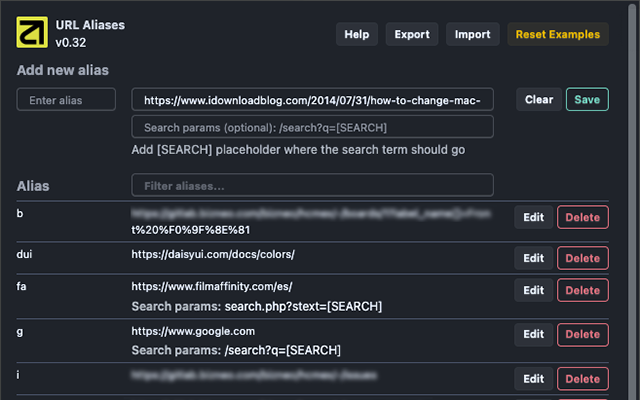

Description
============

URL Aliases is a Chrome extension that simplifies web navigation by allowing users to create and use short, memorable aliases instead of typing long URLs. By typing "go" followed by an alias in the address bar, users can quickly access their favorite websites and even perform direct searches on those sites, saving time and improving productivity.

## How to use aliases

To use an alias:

1. Type `**go**` in the browser's address bar and press space or Tab.
2. Type the alias name (e.g., `**amz**`)
3. Press Enter to go to the assigned URL.

For example, if we define `amz` as an alias for `https://amazon.es`, you would type `go` + space + `amz` in the browser's address bar and press Enter.

## Features

The application's popup offers simple management of aliases and URLs:

- View a list of existing aliases and their corresponding URLs
- Create new aliases
- Edit existing aliases
- Delete aliases
- Export aliases (in JSON format for backup)
- Import aliases (from previously exported JSON)
- Filter aliases to quickly find what you need

## Privacy

- All data is stored locally in your browser.
- No personal information is collected.
- No data is sent to external servers.
- No analytics or tracking services are used.

## Installation

1. Download the source code
2. Open Chrome and navigate to chrome://extensions/
3. Enable "Developer mode"
4. Click on "Load unpacked" and select the project folder

## Compile Tailwind styles

`npx tailwindcss -i ./src/input.css -o ./URL-Aliases/tailwind.css`

Or use the watcher:

`npx tailwindcss -i ./src/input.css -o ./URL-Aliases/tailwind.css --watch`

## Version

Check the version history in the extension details.
